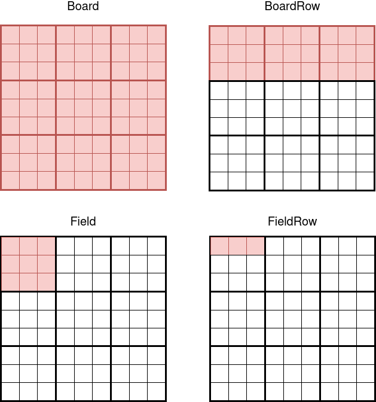

# Sudoku

## About
This is an implementation of various sudoku algorithms.
First of all the algorithms will be used to generate a problem, with a possible solution.
Afterwards the algorithms should be adjusted to solve the generated problem independent of the building of the sudoku problem.

### Algorithms
1. Brute Force & Backtracking (Iterative & Recursive)
2. ILP / SMT
3. Brute Force With Dynamic Backtracking
4. Exact Cover (Mathematical Solution)
5. Random Insert Of Numbers -> Test For Working Solution

## Explanation Of The Implementation
The sudoku board is build with the classes inside the 'Board' directory.
The picture clarifies the board structure.
The size of the sudoku is always a square. In the picture the size of the sudoku board is three. The following explanation will always use the picture size. The size can be adjusted to a positive integer number and is therefore scalable.

In the picture below the 'Board' uses three 'BoardRow' and each 'BoardRow' consists of three 'Field'.
Each 'Field' is an array of three 'FieldRow'. The 'FieldRow' is an array of three integers.
An Empty value is either represented by 'None' or '-1'.



All algorithms are in the 'ProblemGenerator' directory. Each of them extends the abstract class 'ProblemBaseClass'. The 'ProblemBaseClass' defines two methods. The method 'returnProblem()' should set the board with a sudoku problem. The 'returnProblemSolution()' should return a solution.
The difficulty parameter in the 'returnProblem()' function is a constant, which specifies how many values on the board are not set.

The PdfService will print, if called, a pdf with the given board. The method to use is 'printSudoku()', with the only parameter being the title and name of the pdf. These will be put in the 'generated' directory.

The command line will also print the board if specified. And for now also prints some information about the sudoku board.

## Running

### Docker
You can run the application inside a docker container.
Therefore you have to follow theses steps:
1. make build-image
2. make container
3. make run

With the parameter 'SIZE' you can specify the size of the board. For example you can switch the default board size from three to two with: ```make run SIZE=2```

With setting the parameter 'PRINT' to "True" the programm will print the problem and the solution as pdf.

### Local
Without docker you need to install python3 on your machine and add the modules specified in the 'requirements.txt'.
Then you can start the application with 'python main.py'.

If you want the print the solution and the problem as pdf you will have to install "wkhtmltopdf" and set the option '-p' when running "main.py".
